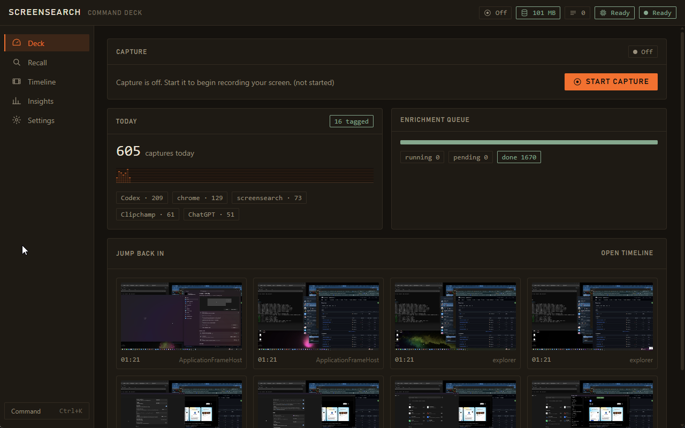
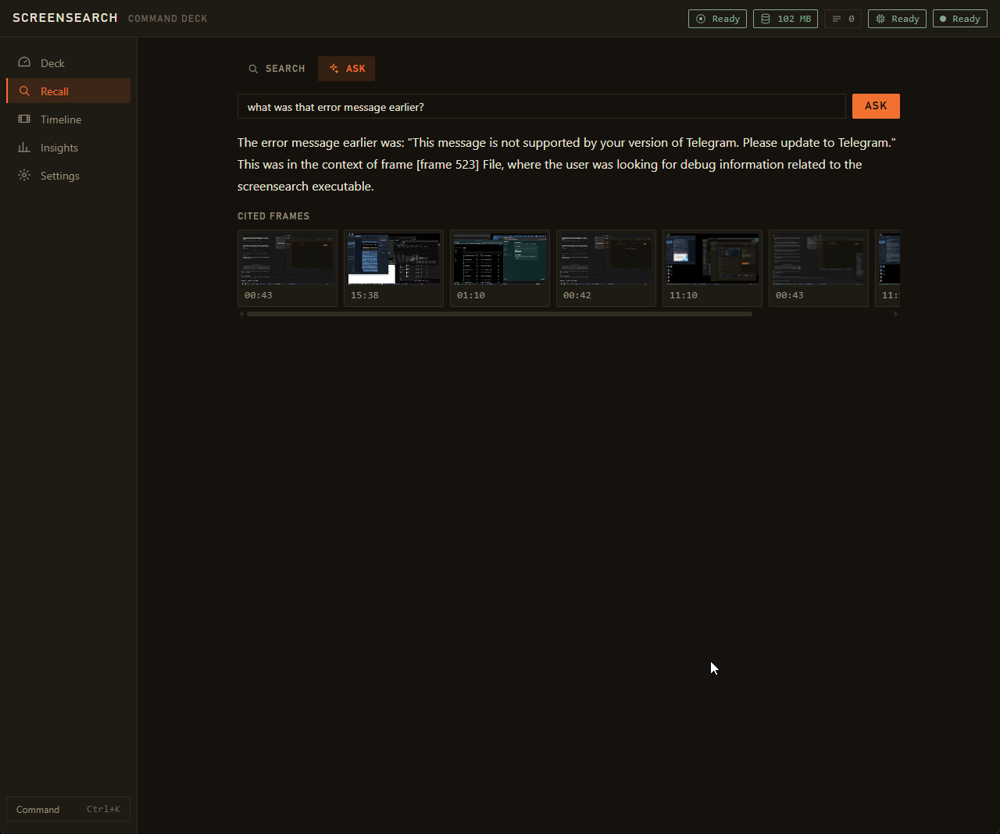
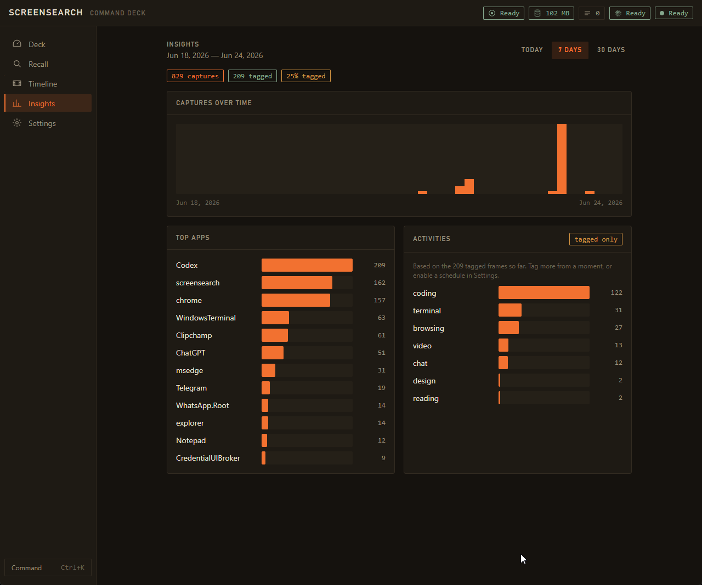
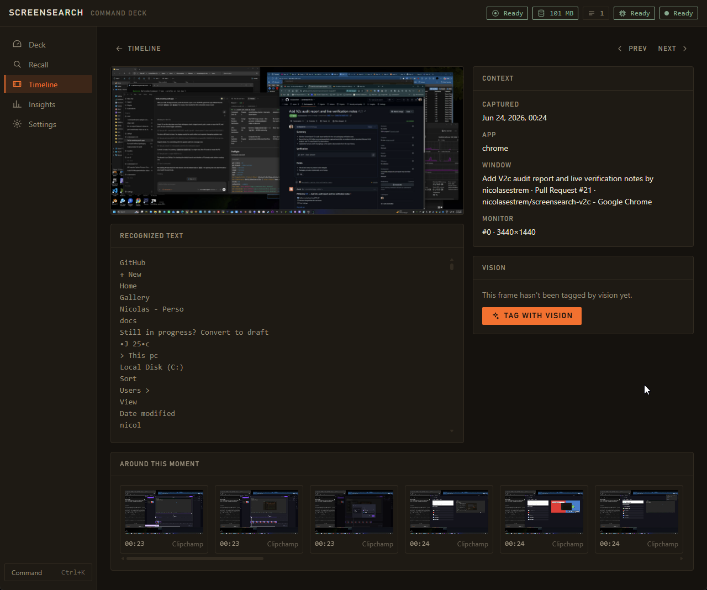
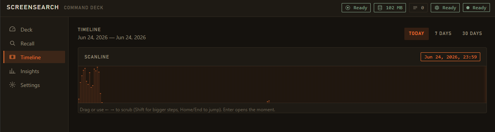

# ScreenSearch V2c

A local-first **Windows** desktop app that continuously captures your screen, makes it
searchable by **text and meaning**, and answers questions about what you've seen — fully
on-device, no cloud.

> **Status: feature-complete; P5 UI verification and packaging pending.** Capture → OCR → deferred enrichment → **hybrid
> search**, the **llama.cpp inference sidecar** (vision tagging + grounded streaming `ask`), and the
> full **Command-Deck UI** (Deck, Recall, Timeline, Moment, Insights, Settings) are implemented and
> exercised on the live app, including the P5 review hardening for bounded IPC, request-scoped ask
> streams, storage telemetry, retention enforcement, monitor/device selection, adaptive charts, and
> live enrichment reconfiguration. Phases **P0–P4 are complete and verified**; the **P5 Command-Deck
> UI is feature-complete**, with its full keyboard / state / a11y matrix still being verified. A
> 2026-06-23 evidence-driven audit exercised the **live app on real hardware** — GPU `llama-server`
> runtime, real vision tagging, grounded `ask`, and ~33 ms p95 search on 10 000 frames — and tracks
> the open UI gaps (the keyboard/state/a11y matrix, and a no-evidence answer still rendering
> cited-frame tiles) in [`docs/AUDIT_V2C_2026-06-23.md`](./docs/AUDIT_V2C_2026-06-23.md). **Packaging**
> (installer + portable ZIP, code signing — DoD §13.9) remains beyond that. The design lives in
> [`specs/`](./specs); the as-built architecture is in
> [`docs/ARCHITECTURE.md`](./docs/ARCHITECTURE.md). A standalone, clean-slate project (not linked to,
> and importing no data from, any prior version).

## Screenshots

The **Command Deck** — six on-device screens over your screen history (five shown below; Settings
omitted). Nothing here touches the network: every frame, query, and answer stays on the machine.



> **Deck** — start/stop capture, today's capture count with a per-app breakdown, the live enrichment
> queue, and a "jump back in" strip of recent frames.

| Recall — grounded **Ask** | Insights — activity analytics | Moment — frame detail |
|:--:|:--:|:--:|
| [](screenshots/recall-ask.png) | [](screenshots/insights.png) | [](screenshots/moment.png) |
| Ask in plain language; answers **cite the exact frames** they came from. | Captures over time, top apps, and inferred activities from vision tags. | One moment's recognized text and context, with on-demand **vision tagging**. |



> **Timeline** — scrub a day / week / month of captures on a scanline; `Enter` opens the Moment.

## Build progress

| Phase | Scope | Status |
|---|---|---|
| **P0** | Scaffold — Cargo workspace, `traits` contracts, Tauri 2 shell, React/TS UI, `ts-rs` IPC, CI, `doctor` | ✅ Complete |
| **P1** | Data spine — SQLite (WAL) + FTS5 + sqlite-vec, forward-only migrations, durable job queue, hybrid search | ✅ Complete |
| **P2** | Capture happy path — WGC capture + diff/privacy gates, WinRT OCR, kernel event bus, minimal live timeline | ✅ Complete |
| **P3** | Deferred enrichment — fastembed embedding worker pool, vector arm live, `search` command, perf-verified | ✅ Complete |
| **P4** | Inference sidecar — llama.cpp (Job-Object-bound, no-orphan), vision tagging, grounded streaming `ask` | ✅ Complete |
| **P5** | Command-Deck UI (Deck, Recall, Timeline, Moment, Insights, Settings) + typed IPC | 🚧 Feature-complete; UI verification in progress |
| **Pkg** | Installer + portable ZIP, `onnxruntime.dll` bundling, code signing (DoD §13.9) | ⏳ Deferred follow-up |

> **P5 verification** (per the [2026-06-23 audit](./docs/AUDIT_V2C_2026-06-23.md)): all six screens
> are built and the P5 review hardening landed, but the full keyboard/state/a11y matrix is not yet
> verified and a no-evidence answer can still render cited-frame tiles. P0–P4 verified clean (with a
> minor P2 OCR caveat noted in the audit).

### Working today
Start capture → each changed frame is OCR'd, stored, and JPEG-archived → an `embed_text` job is
enqueued → a background worker pool embeds it with **fastembed** (EmbeddingGemma-300M, 768-dim) →
**hybrid search** (FTS5 keyword + sqlite-vec semantic, fused with Reciprocal Rank Fusion) returns
the right frames in **~33 ms p95 on a 10 000-frame database**. **Vision tagging** (on-demand / timer /
idle — structured output with an honest confidence, never a fabricated score) and **grounded,
streaming answers** with citations run on the local **llama.cpp sidecar**; the full Command-Deck UI
surfaces all of it. Retention purges run at startup and hourly when enabled, and the StatusRail shows
real DB/frame storage usage.

## What it does (v1.0 target)

- **Always-on, cheap capture** — screen capture (Windows.Graphics.Capture) + native WinRT OCR,
  written straight to a local SQLite store. *(P2 — done)*
- **Deferred, user-controlled enrichment** — embeddings run as durable jobs in a SQLite-backed
  queue, drained by a background worker pool; vision tagging is **on-demand / timed / idle** only.
  *(embeddings P3 — done; vision P4 — done)*
- **Hybrid search** — FTS5 keyword + vector (sqlite-vec) semantic, fused with Reciprocal Rank
  Fusion. *(P3 — done)*
- **Grounded, reasoning answers** — RAG over your screen history via a local llama.cpp model with
  a *thinking* mode. *(P4 — done)*

## Architecture (summary)

- **Shell:** Tauri 2 + WebView2; React 18 + TypeScript UI; typed IPC via `ts-rs`.
- **Core:** a modular Rust **kernel** — trait-bounded modules over a typed event bus; `src-tauri`
  is the composition root that wires concrete impls in.
- **Processing:** *capture-cheap, enrich-deferred* — a durable SQLite **job queue** drained by a
  bounded worker pool (with retry/backoff, dead-lettering, and stale-job recovery).
- **Data:** SQLite (WAL) + FTS5 + sqlite-vec (768-dim, cosine); forward-only migrations.
- **Embeddings:** **fastembed** (in-process ONNX) — EmbeddingGemma-300M text, optional
  nomic-embed-vision-v1.5 image. **No Python in the runtime.**
- **Inference (P4):** a single supervised, model-agnostic **llama.cpp sidecar** (Vulkan GPU + CPU
  fallback), **bound to the app via a Windows Job Object** so it can never orphan after a crash;
  advanced users can list/select llama.cpp devices when the default Vulkan device is wrong.

See [`docs/ARCHITECTURE.md`](./docs/ARCHITECTURE.md) for the as-built design and data flow.

### Models (user-selectable, 3 tiers per lane)

| Lane | Default | Quality | Beta |
|---|---|---|---|
| **Vision** (P4) | Qwen3-VL-4B-Instruct | Qwen3-VL-8B-Instruct | Qwen3.5-9B-VLM |
| **Answer** (P4) | Ministral-3-3B-Reasoning-2512 | Qwen3-4B-Thinking-2507 | NVIDIA-Nemotron-3-Nano-4B |
| **Embeddings** | EmbeddingGemma-300M (text) · nomic-embed-vision-v1.5 (image) | | |

Exact HF repos / quants are pinned in [`specs/MODEL_REGISTRY.md`](./specs/MODEL_REGISTRY.md).
Embedding models auto-download on first use into `<app-data>/models/fastembed`.

## Repository layout

```
CLAUDE.md          agent entry point (Claude Code) — mandatory reading order + hard rules
AGENTS.md          agent entry point (Codex) — same contract, Codex-flavored
README.md          this file
CHANGELOG.md       human-facing changelog (Keep a Changelog)
Cargo.toml         Cargo workspace (centralized dependency versions)
docs/
  ARCHITECTURE.md          as-built system design + data flow
  AUDIT_V2C_2026-06-23.md  live-runtime verification pass (evidence + known gaps)
screenshots/       Command-Deck UI screenshots (used by this README)
crates/
  traits/          module contracts + shared domain/IPC/job types (no impls)
  kernel/          orchestrator: event bus, capture loop, worker pool, settings
  store/           data spine: SQLite + sqlite-vec + FTS5, job queue, hybrid search
  capture/         CaptureSource (WGC) + diff/privacy gates
  ocr/             OcrProvider (WinRT Media.Ocr, STA worker)
  embeddings/      EmbeddingProvider (fastembed, in-process ONNX)
  inference/       VisionProvider + AnswerProvider + llama.cpp supervisor (Job-Object lifecycle)
  doctor/          WebView2 / Vulkan / llama-server environment smoke-check
src-tauri/         Tauri 2 shell + composition root + command handlers + main()
ui/                React 18 + TS + Vite — the full "Command Deck" (6 screens, typed IPC)
specs/             spec-engineering pipeline (00 intake → 04 build prompt → 05–08 build/review)
                   + UI_REFERENCE.md   (frontend identity, tokens, screens, state matrix)
                   + MODEL_REGISTRY.md (exact HF repos / quants / mmproj per model tier)
```

## Build & run

Prerequisites: **Windows 10/11**, a recent Rust toolchain (workspace MSRV **1.82**), Node.js +
npm, and WebView2 (preinstalled on current Windows). First run downloads the embedding model
(~hundreds of MB) and an ONNX Runtime build at compile time.

```powershell
# 1. UI first — src-tauri's `generate_context!` embeds `ui/dist` (git-ignored), so the
#    Rust build fails if the UI hasn't been built yet. `npm run lint` is the Rules-of-Hooks gate.
cd ui && npm ci && npm run lint && npm run build && cd ..

# 2. Rust workspace
cargo fmt --all -- --check
cargo clippy --workspace --all-targets -- -D warnings
cargo build --workspace
cargo test --workspace            # GPU/WinRT/model/perf tests are #[ignore]d

# 3. Binding guard — `cargo test` regenerates the ts-rs IPC bindings; they must stay clean
#    (commit the regenerated files, or CI fails).
git diff --exit-code -- ui/src/bindings

# Run the app (debug) — the Tauri CLI ships as the npm dev-dependency `@tauri-apps/cli`,
# so launch via the root npm script (use `cargo tauri dev` only if you `cargo install tauri-cli`).
npm run tauri dev
```

Model-backed and hardware tests are gated behind `#[ignore]` (they download models or need a real
display/GPU). Run them locally:

```powershell
cargo test -p embeddings -- --ignored                       # loads the real EmbeddingGemma model
cargo test -p store --test perf -- --ignored --nocapture    # hybrid-search latency on 10k frames
cargo test -p ocr -- --ignored                              # WinRT OCR smoke (needs a language pack)
cargo test -p inference --test smoke -- --ignored --nocapture  # real llama-server: vision tag + grounded ask (GPU)
```

## Environment check

```powershell
cargo run -p doctor            # WebView2 / Vulkan / llama-server readiness (diagnostic; add -- --json)
```

## Platform

Windows 10/11 only (uses Windows-native capture, OCR, and WebView2 APIs). Cross-platform
abstractions are intentionally **not** added (see `CLAUDE.md`).

## License

[MIT](./LICENSE) © 2026 Nicolas Estrem
