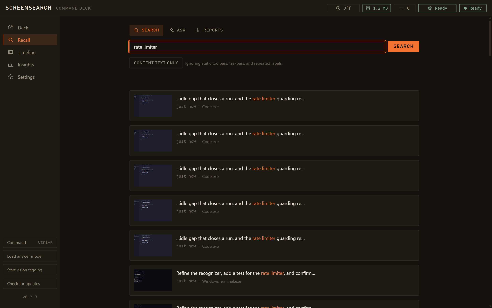

# ScreenSearch V2c

A local-first **Windows** desktop app that continuously captures your screen, makes it
searchable by **text and meaning**, and answers questions about what you've seen — fully
on-device, no cloud.

**It's also memory your agents can query.** Where most screen-recall tools stop at a search box for
you, ScreenSearch exposes your screen history through an opt-in local **MCP server**
(`screensearch-mcp`) — so Claude Desktop, Claude Code, or any MCP client can search your captures,
ask grounded questions with cited frames, and, as of v0.4.0, reason over automatically segmented
**work sessions** (`list_sessions`, `get_session`, `ask_session`). Every answer is drawn from the
local database over `127.0.0.1`; nothing leaves the machine.

> **Status — v0.4.0 shipped (2026-07-11).** The full app is live: capture → OCR/UIA text →
> deferred enrichment → **hybrid search**, a supervised out-of-process **llama.cpp inference
> sidecar** (Job-Object-bound) for vision tagging and grounded streaming answers, the six-screen
> **Command Deck** UI, a
> global-hotkey **Flow overlay**, an opt-in **local HTTP API + MCP server**, **auto-update**,
> and a native **system tray**. The latest arc groups captured frames into **sessions** with a
> pure on-device heuristic. **Authenticode code-signing** is the one remaining packaging
> follow-up — until then the NSIS installer is unsigned and SmartScreen warns ("More info →
> Run anyway"). Full release history is in
> [`CHANGELOG.md`](./CHANGELOG.md) / [`CHANGELOG-ARCHIVE.md`](./CHANGELOG-ARCHIVE.md); the
> design lives in [`specs/`](./specs) and the as-built architecture in
> [`docs/ARCHITECTURE.md`](./docs/ARCHITECTURE.md). A standalone, clean-slate project — it
> shares no code or data with any prior version.

## Screenshots

The **Command Deck** is six on-device screens over your screen history — Deck, Recall, Insights,
Moment, Timeline, and Settings. Nothing here touches the network: every frame, query, and answer
stays on the machine.


> **Deck** — the at-a-glance home: capture status, today's activity and top apps, where-was-I
> resume, intentions (marks), and recent captures.


> **Timeline** — scrub a day / week / month of captures on a scanline, with **session bands**
> (focus, meeting, and concurrent AI-tool sessions) layered over the density. `Enter` opens the
> Moment.



> **Recall** — hybrid text + semantic search over everything on screen; grounded **Ask** and
> recall **Reports** share the screen. Matches are highlighted and link straight to the captured
> frame.


> **Insights** — truthful aggregates over a range: captures over time, top foreground apps, and
> the activity-type breakdown.


> **Moment** — a single capture in full: the image, its session, recognized text, vision tags,
> and the neighbouring captures.

> **Note:** every screenshot above is rendered against **synthetic seed data** — invented frames,
> sessions, and text with no personal content (see [`docs/SCREENSHOTS.md`](docs/SCREENSHOTS.md)).

## What it does

- **Always-on, cheap capture.** Windows.Graphics.Capture writes changed frames straight to a local
  SQLite store, behind diff and privacy gates. Capture runs on a timer by default, with opt-in
  event-driven triggers (foreground + idle). Each frame is archived as lossless WebP.
- **On-device text extraction.** Foreground-window text via **UI Automation**, falling back to
  native **WinRT OCR**, then an **attention-first filter** that keeps content text over chrome
  (raw text stays available opt-in).
- **Deferred, user-controlled enrichment.** Embeddings run as durable jobs in a SQLite-backed
  queue drained by a bounded worker pool; **vision tagging is on-demand / timed / idle only** —
  never real-time. An optional CPU/GPU pressure throttle eases off background work under load
  without ever pausing capture, OCR, or storage.
- **Hybrid search.** FTS5 keyword + sqlite-vec semantic, fused with Reciprocal Rank Fusion —
  **~33 ms p95 on a 10 000-frame database**. Embeddings are EmbeddingGemma-300M (768-dim) via
  **fastembed** (in-process ONNX).
- **Grounded answers & reports.** RAG over your screen history through the local **llama.cpp
  sidecar**: streaming answers with cited frames, and Daily / Weekly / Custom **Recall reports**
  that cite the frames they used. Vision tagging emits structured output with an honest confidence,
  never a fabricated score.
- **Sessions.** A pure on-device heuristic groups frames into focus, meeting, and concurrent
  AI-tool sessions — additively, with no model calls and no change to frame-level behavior.
  Sessions surface in the Timeline, the local API, and MCP.
- **Fast recall overlay.** `Ctrl+Alt+Z` opens the **Flow overlay** — a second, capture-protected
  Tauri window for quick Search/Ask without leaving your foreground app. `Esc` hides it; `Enter`
  opens the selected Moment in the main Command Deck. `Ctrl+Alt+M` marks the current moment.
- **Local API + MCP.** An opt-in localhost HTTP API (off by default, `127.0.0.1` + bearer token)
  exposes search / ask / frames / marks / sessions and JSON export to local scripts and agents.
  `screensearch-mcp.exe` — bundled in the installer — wraps it as a stdio **MCP server** for
  Claude Desktop / Claude Code (see [`docs/API.md`](docs/API.md), [`docs/MCP.md`](docs/MCP.md)).
- **Lives in the tray, updates itself.** A native system tray with a passive capture-state icon
  and quick actions keeps capture running when you close the window (a one-time toast explains it;
  run-at-startup is off by default). From v0.3.2 on the app auto-updates: a signed manifest is
  checked at launch, the new installer downloads in the background, and it installs only when you
  choose to restart — no modal, no nag.

## Build progress

| Phase | Scope | Status |
|---|---|---|
| **P0** | Scaffold — Cargo workspace, `traits` contracts, Tauri 2 shell, React/TS UI, `ts-rs` IPC, CI, `doctor` | ✅ Complete |
| **P1** | Data spine — SQLite (WAL) + FTS5 + sqlite-vec, forward-only migrations, durable job queue, hybrid search | ✅ Complete |
| **P2** | Capture happy path — WGC capture + diff/privacy gates, WinRT OCR, kernel event bus, live timeline | ✅ Complete |
| **P3** | Deferred enrichment — fastembed embedding worker pool, vector arm, `search` command, perf-verified | ✅ Complete |
| **P4** | Inference sidecar — llama.cpp (Job-Object-bound, no-orphan), vision tagging, grounded streaming `ask` | ✅ Complete |
| **P5** | Command-Deck UI (Deck, Recall, Timeline, Moment, Insights, Settings) + typed IPC | ✅ Feature-complete; live-verified |
| **Pkg** | Unsigned **NSIS** installer shipped; **Authenticode code-signing** is the lone follow-up (DoD §13.9, `07` #26) | 🚧 Signing pending |

Post-v1.0 arcs — attention-first text (0.2.x), surface reduction + flow recall + local API (0.3.0),
the product shell (auto-update, tray, two-tier Settings — 0.3.2), and the sessions reframe (0.4.0) —
have all shipped. Each arc's detailed record lives in its `docs/<version>.md` and in
[`CHANGELOG-ARCHIVE.md`](./CHANGELOG-ARCHIVE.md); point-in-time PR audits live as local-only
artifacts under `docs/audits/` (git-ignored, not pushed).

## Architecture (summary)

- **Shell:** Tauri 2 + WebView2; React 18 + TypeScript UI; typed IPC via `ts-rs`; a main Command
  Deck window plus a pre-created protected Flow overlay summoned by a global shortcut.
- **Core:** a modular Rust **kernel** — trait-bounded modules over a typed event bus; `src-tauri`
  is the composition root that wires the concrete impls in.
- **Processing:** *capture-cheap, enrich-deferred* — a durable SQLite **job queue** drained by a
  bounded worker pool (retry/backoff, dead-lettering, stale-job recovery). An optional CPU/GPU
  pressure throttle reduces background enrichment under load; capture/OCR/storage never pause.
- **Text source:** foreground-window text via **UI Automation** with automatic fallback to native
  **WinRT OCR**, then an attention-first filter that keeps content over chrome.
- **Data:** SQLite (WAL) + FTS5 + sqlite-vec (768-dim, cosine); forward-only migrations
  (current schema version 11).
- **Embeddings:** **fastembed** (in-process ONNX) — EmbeddingGemma-300M text. **No Python in the
  runtime.**
- **Inference:** a single supervised, model-agnostic **llama.cpp sidecar** (Vulkan GPU + CPU
  fallback), **bound to the app via a Windows Job Object** so it can never orphan after a crash;
  advanced users can list/select llama.cpp devices when the default Vulkan device is wrong.

See [`docs/ARCHITECTURE.md`](./docs/ARCHITECTURE.md) for the as-built design and data flow.

### Models (user-selectable, 2 tiers per lane)

| Lane | Default | Quality |
|---|---|---|
| **Vision** | Qwen3-VL-4B-Instruct | Qwen3-VL-8B-Instruct |
| **Answer** | Ministral-3-3B-Reasoning-2512 | Qwen3-4B-Thinking-2507 |
| **Embeddings** | EmbeddingGemma-300M (text) | |

Exact HF repos / quants are pinned in [`specs/MODEL_REGISTRY.md`](./specs/MODEL_REGISTRY.md).
Embedding models auto-download on first use into `<app-data>/models/fastembed`.

## Repository layout

```
CLAUDE.md          agent entry point (Claude Code) — mandatory reading order + hard rules
AGENTS.md          agent entry point (Codex) — same contract, Codex-flavored
README.md          this file
CHANGELOG.md       human-facing changelog (Keep a Changelog); older releases in CHANGELOG-ARCHIVE.md
Cargo.toml         Cargo workspace (centralized dependency versions)
docs/
  ARCHITECTURE.md          as-built system design + data flow
  API.md / MCP.md          local HTTP API + MCP server reference
  TESTING.md               test matrix and how to run the gated suites
  <version>.md             per-arc design + build records (0.2.0 … 0.4.0)
  audits/                  point-in-time PR audit evidence (local-only, git-ignored)
screenshots/       Command-Deck UI screenshots used by this README
crates/            15-crate Rust workspace (module crates depend on `traits` only):
  traits/          module contracts + shared domain/IPC/job types (no impls)
  kernel/          orchestrator: event bus, capture loop, worker pool, settings, resume heuristic
  store/           data spine: SQLite + sqlite-vec + FTS5, job queue, hybrid search
  capture/         CaptureSource (WGC) + diff/privacy gates + event-driven triggers
  ocr/             OcrProvider (WinRT Media.Ocr, STA worker)
  uia/             UI Automation foreground-window text source (OCR fallback)
  textfilter/      pure, deterministic span-aware text classifier (attention-first filtering)
  embeddings/      EmbeddingProvider (fastembed, in-process ONNX)
  inference/       VisionProvider + AnswerProvider + llama.cpp supervisor (Job-Object lifecycle)
  sysmon/          CPU/GPU pressure probe driving the enrichment throttle
  doctor/          WebView2 / Vulkan / llama-server environment smoke-check
  api/             opt-in localhost HTTP API + JSON export (axum, 127.0.0.1 + bearer token)
  mcp/             screensearch-mcp.exe — stdio MCP wrapper over the local API
  sessions/        pure heuristic session segmentation + tool recognition (no model calls)
  harness/         dev-only, read-only segmentation validation harness (not shipped in the app)
src-tauri/         Tauri 2 shell + composition root + command handlers + main()
ui/                React 18 + TS + Vite — the full "Command Deck" (6 screens, typed IPC)
specs/             spec-engineering pipeline (00 intake → 04 build prompt → 05–08 build/review)
                   + UI_REFERENCE.md   (frontend identity, tokens, screens, state matrix)
                   + MODEL_REGISTRY.md (exact HF repos / quants / mmproj per model tier)
```

## Build & run

Prerequisites: **Windows 10/11**, a recent Rust toolchain (workspace MSRV **1.82**), Node.js 22 +
npm, and WebView2 (preinstalled on current Windows). First run downloads the embedding model
(~hundreds of MB) and an ONNX Runtime build at compile time.

```powershell
# 1. UI first — src-tauri's `generate_context!` embeds `ui/dist` (git-ignored), so the
#    Rust build fails if the UI hasn't been built yet. `npm run lint` is the Rules-of-Hooks gate.
cd ui && npm ci && npm run lint && npm run build && cd ..

# 2. Stage the MCP sidecar — src-tauri declares `screensearch-mcp.exe` as a `bundle.externalBin`
#    that `tauri-build` resolves on every compile, so a fresh clone must stage it once before any
#    cargo command (npm run dev / build do this automatically; a bare cargo build does not).
node scripts/stage-mcp.mjs

# 3. Rust workspace
cargo fmt --all -- --check
cargo clippy --workspace --all-targets -- -D warnings
cargo build --workspace
cargo test --workspace            # GPU/WinRT/model/perf tests are #[ignore]d

# 4. Binding guard — `cargo test` regenerates the ts-rs IPC bindings; they must stay clean
#    (commit the regenerated files, or CI fails).
git diff --exit-code -- ui/src/bindings

# Run the app (debug) — the Tauri CLI ships as the npm dev-dependency `@tauri-apps/cli`,
# so launch via the root npm script (use `cargo tauri dev` only if you `cargo install tauri-cli`).
npm run dev
```

Model-backed and hardware tests are gated behind `#[ignore]` (they download models or need a real
display/GPU). Run them locally:

```powershell
cargo test -p embeddings -- --ignored                       # loads the real EmbeddingGemma model
cargo test -p store --test perf -- --ignored --nocapture    # hybrid-search latency on 10k frames
cargo test -p ocr -- --ignored                              # WinRT OCR smoke (needs a language pack)
cargo test -p inference --test smoke -- --ignored --nocapture  # real llama-server: vision tag + grounded ask (GPU)
```

See [`docs/TESTING.md`](docs/TESTING.md) for the full test matrix.

## Environment check

```powershell
cargo run -p doctor            # WebView2 / Vulkan / llama-server readiness (diagnostic; add -- --json)
```

## Platform

Windows 10/11 only (uses Windows-native capture, OCR, and WebView2 APIs). Cross-platform
abstractions are intentionally **not** added (see [`CLAUDE.md`](./CLAUDE.md)).

## Inspirations & prior art

ScreenSearch stands on a small but real lineage of "record your screen, make it searchable"
projects. A few that shaped the thinking here, in different ways:

- [screenpipe](https://github.com/mediar-ai/screenpipe) — open-source, local-first continuous
  screen (and audio) capture with search; the closest kin to this project's goals.
- [Rewind.ai](https://www.rewind.ai/) — the macOS "perfect memory" app that popularized personal,
  on-device screen recall and natural-language questions over what you've seen.
- [Rem](https://github.com/jasonjmcghee/rem) — an open-source, local-first take on the same idea for
  macOS.
- [OpenRecall](https://github.com/openrecall/openrecall) — a privacy-first, cross-platform open
  alternative in the same space.

ScreenSearch's approach differs in a few key ways:

- **Windows-only by design** — native Windows APIs (capture, OCR, WebView2), no cross-platform
  abstractions.
- **Rust-only ML runtime** — fastembed and a local llama.cpp sidecar, with no cloud calls.
- **Heuristic sessions** — frames are grouped into sessions by a pure on-device heuristic rather
  than a model.

Everything runs on-device.

## License

[MIT](./LICENSE) © 2026 Nicolas Estrem
